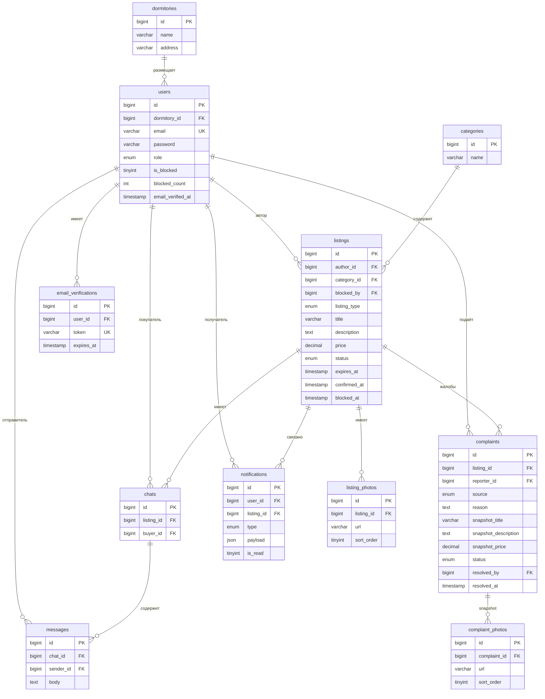
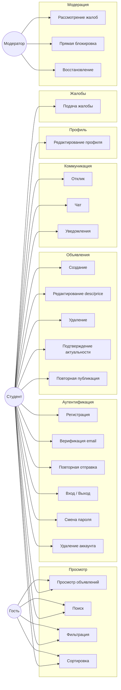
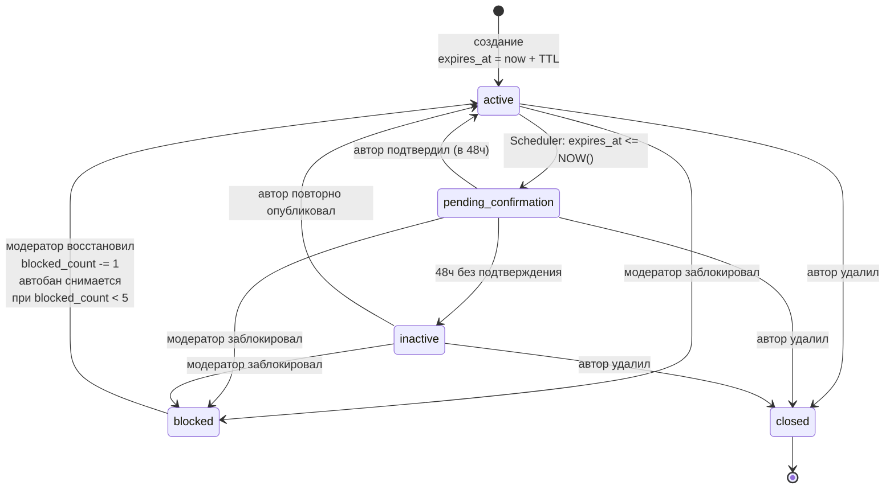
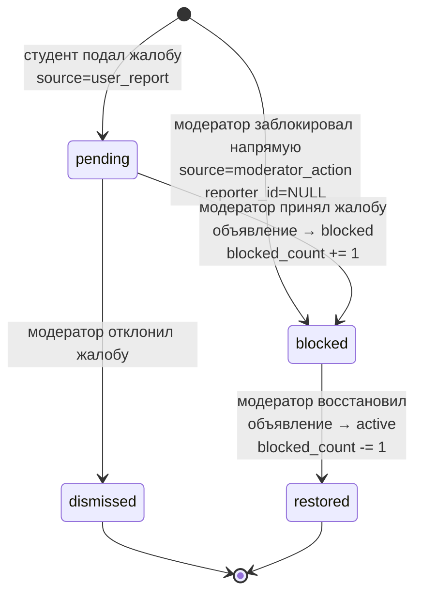
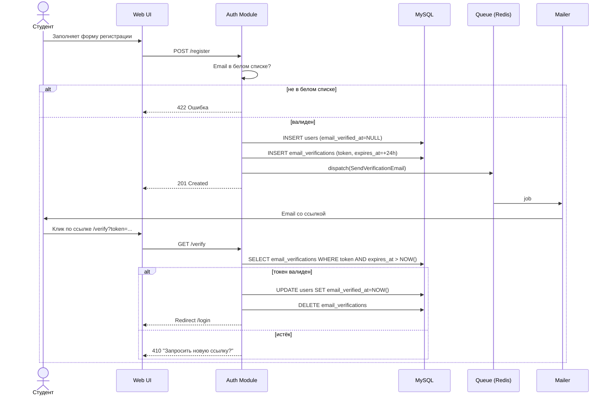
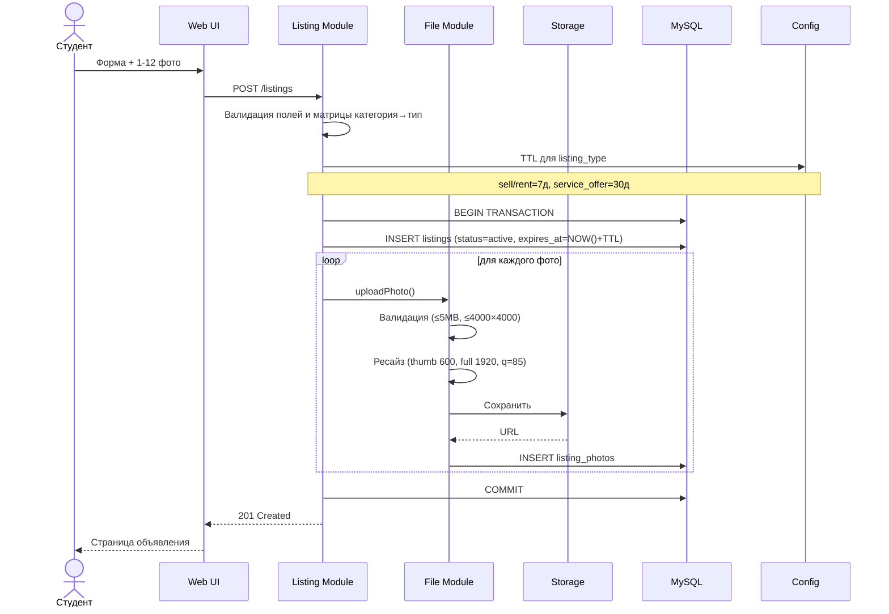
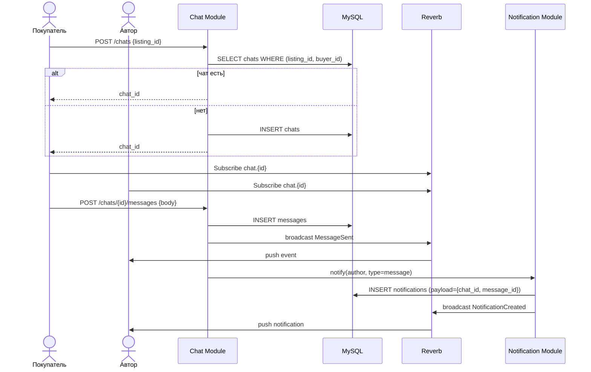
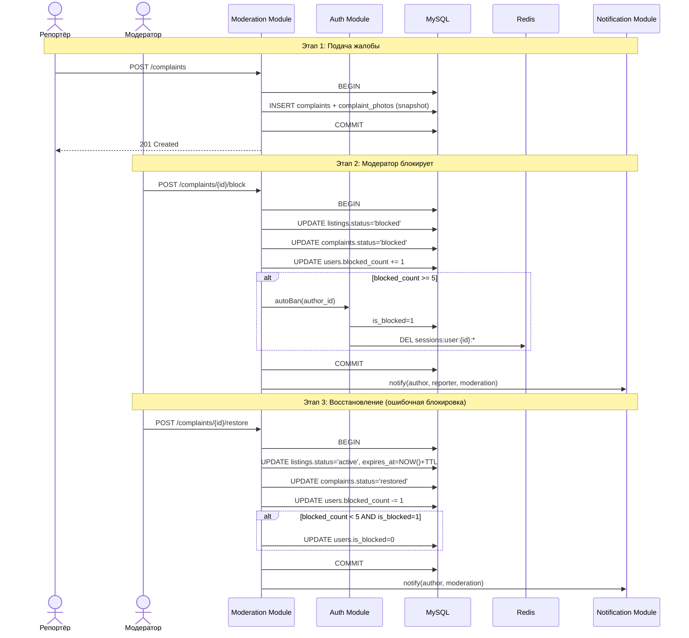

# ОбщМаркет — Software Requirements Specification

**Система поиска и размещения объявлений среди студентов общежития**

**Версия 2.0** | 2026 | Статус: Финальные требования

---

## Оглавление

1. [Введение](#1-введение)
2. [Роли пользователей](#2-роли-пользователей)
3. [Функциональные требования](#3-функциональные-требования)
4. [Категории и типы объявлений](#4-категории-и-типы-объявлений)
5. [Модель данных](#5-модель-данных-mysql-8)
6. [Архитектура системы](#6-архитектура-системы)
7. [Нефункциональные требования](#7-нефункциональные-требования)
8. [Диаграммы](#8-диаграммы)
9. [История изменений требований](#9-история-изменений-требований)
10. [User flows и карта экранов](#10-user-flows-и-карта-экранов)

---

## 1. Введение

### 1.1 Назначение документа

Настоящий документ является спецификацией требований к программному обеспечению (SRS) системы ОбщМаркет. Документ описывает функциональные и нефункциональные требования, архитектуру, модель данных и проектные решения, принятые в ходе анализа требований.

### 1.2 Область применения

ОбщМаркет — веб-приложение для размещения и поиска объявлений о продаже товаров и оказании услуг среди студентов, проживающих в студенческом общежитии. Система обеспечивает коммуникацию между пользователями через встроенный чат и содержит механизмы модерации контента.

Текущая версия (MVP) ориентирована на одно общежитие. Архитектура спроектирована с учётом масштабирования до 6 общежитий в будущем.

### 1.3 Ограничения

- Система не предусматривает онлайн-оплату — финансовые расчёты осуществляются вне системы.
- Область применения MVP ограничена одним общежитием.
- Регистрация доступна только по корпоративному email учебного заведения.
- Просмотр объявлений доступен без регистрации; создание объявлений и отклик требуют авторизации.

### 1.4 Технологический стек

| Компонент | Технология |
|---|---|
| Backend | PHP 8.x + Laravel 11 (монолит) |
| Frontend | Blade-шаблоны + Alpine.js |
| База данных | MySQL 8 |
| Кеш и очереди | Redis |
| WebSocket (realtime) | Laravel Reverb |
| Хранилище файлов | Local disk (MVP) → S3-совместимое |
| Web-сервер | Nginx + PHP-FPM |
| Email | SMTP / Mailgun |

---

## 2. Роли пользователей

В системе определены три роли. Модератор наследует все права студента и дополнительно получает инструменты модерации.

| Роль | Хранится в БД | Возможности |
|---|---|---|
| **Гость** | Нет (неавторизован) | Просмотр объявлений, текстовый поиск, фильтрация по категории / типу / цене |
| **Студент** | Да (`role = student`) | Всё что Гость + регистрация, вход, создание/редактирование/удаление объявлений, отклик, чат, жалобы, управление профилем |
| **Модератор** | Да (`role = moderator`) | Всё что Студент + просмотр жалоб, блокировка/восстановление объявлений напрямую без жалобы, рассмотрение жалоб пользователей |

**Примечание:** Гость — не роль в БД, а состояние сессии (отсутствие аутентификации). Ограничения прав гостя реализуются через middleware `auth`. В таблице `users.role` определены только значения `student` и `moderator`.

---

## 3. Функциональные требования

### 3.1 Регистрация и аутентификация

| ID | Требование | Описание |
|---|---|---|
| AUTH-01 | Регистрация по корп. email | Система принимает только email с доменом из белого списка. При попытке зарегистрироваться с неразрешённым доменом — ошибка. |
| AUTH-02 | Подтверждение email | После регистрации отправляется письмо со ссылкой-токеном. Токен действителен 24 часа. Без подтверждения вход невозможен. |
| AUTH-03 | Вход в систему | Проверяется email, пароль и флаг `is_blocked`. Заблокированный пользователь не может войти даже при верном пароле. |
| AUTH-04 | Выход | Инвалидирует токен сессии в Redis. |
| AUTH-05 | Смена пароля | Доступна в настройках профиля. Требует ввода текущего пароля. |
| AUTH-06 | Удаление аккаунта | Мягкое удаление: данные сохраняются, вход блокируется. Активные объявления переводятся в статус `closed`. |
| AUTH-07 | Повторная отправка верификации | Пользователь может запросить повторную отправку письма верификации. При отправке нового письма старые токены инвалидируются. Rate limit: 1 запрос в минуту, не более 5 запросов в сутки. |

### 3.2 Объявления

| ID | Требование | Описание |
|---|---|---|
| LIST-01 | Создание объявления | Авторизованный студент заполняет: заголовок, категорию, тип, описание, цену (nullable), загружает от 1 до 12 фотографий. Поля `title` / `category_id` / `listing_type` иммутабельны после публикации. |
| LIST-02 | Редактирование | Автор может изменить только `description` и `price`. Остальные поля защищены на уровне API (whitelist) и триггером БД. |
| LIST-03 | Удаление | Только автор. Мягкое удаление: `status = closed`. Из `blocked` и `closed` удалить нельзя. |
| LIST-04 | Просмотр | Доступен всем включая гостей. Показываются только объявления со статусом `active`. |
| LIST-05 | Поиск | LIKE-поиск по заголовку и описанию (MVP). В будущем — полнотекстовый поиск (MySQL FULLTEXT / Meilisearch). |
| LIST-06 | Фильтрация | По категории, типу объявления, диапазону цен. По умолчанию фильтр `dormitory_id` соответствует общежитию текущего пользователя (для гостя — все общежития; в MVP не показывается в UI, т.к. общежитие одно). |
| LIST-07 | Сортировка | По дате (новые сначала / старые сначала), по цене (возрастание / убывание). |
| LIST-08 | Фотографии | Минимум 1 фото обязательно. Максимум 12. Форматы: JPEG, PNG, WebP. Максимальный размер файла 5 МБ. Максимальные габариты исходника 4000×4000 px. При загрузке создаются превью 600×600 и полный размер 1920×1920 (JPEG quality 85). Хранятся в таблице `listing_photos` с полем `sort_order`. |

### 3.3 Жизненный цикл объявления

Поле `status` в таблице `listings` принимает значения: `active`, `pending_confirmation`, `inactive`, `blocked`, `closed`.

Срок жизни (TTL) определяется типом объявления, а не категорией:
- `sell`, `rent` — **7 дней**;
- `service_offer` — **30 дней**.

TTL хранится в `config/listings.php` в виде константы и применяется при создании / восстановлении / повторной публикации.

| Переход | Условие / инициатор |
|---|---|
| `active → pending_confirmation` | Scheduler: `NOW() >= expires_at` |
| `active → blocked` | Модератор принял жалобу или заблокировал напрямую |
| `active → closed` | Автор удалил объявление |
| `pending_confirmation → active` | Автор нажал «Подтвердить актуальность» в течение 48 ч; `expires_at` пересчитывается |
| `pending_confirmation → inactive` | Scheduler: 48 ч прошло, `confirmed_at = NULL` |
| `pending_confirmation → blocked` | Модератор заблокировал объявление |
| `pending_confirmation → closed` | Автор удалил объявление |
| `inactive → active` | Автор повторно опубликовал; `expires_at` пересчитывается |
| `inactive → blocked` | Модератор заблокировал объявление |
| `inactive → closed` | Автор удалил объявление |
| `blocked → active` | Модератор восстановил (ошибочная блокировка); `blocked_count` декрементируется; `expires_at` пересчитывается |

**Запрещённые переходы:** `closed → *` (финальное состояние), `blocked → closed` (автор не может «спрятать» заблокированное объявление удалением).

Визуальное представление см. в разделе [8.3 Диаграмма состояний объявления](#83-диаграмма-состояний-объявления).

### 3.4 Чат

| ID | Требование | Описание |
|---|---|---|
| CHAT-01 | Открытие чата | При отклике на объявление создаётся запись `chats` с уникальной парой (`listing_id`, `buyer_id`). Повторный отклик открывает существующий чат. |
| CHAT-02 | Ограничение | Автор объявления не видит кнопку отклика на собственное объявление. |
| CHAT-03 | Доступ | Только авторизованные пользователи могут откликаться и писать в чат. |
| CHAT-04 | Realtime | Новые сообщения доставляются через WebSocket (Laravel Reverb) без перезагрузки страницы. |
| CHAT-05 | История | При открытии чата загружается полная история сообщений. |
| CHAT-06 | Скрытие чата | Чаты, связанные с объявлениями в статусе `blocked` или `closed`, не отображаются в списке чатов у пользователя (ни у автора, ни у покупателя). Записи в таблицах `chats` и `messages` **не удаляются** — они сохраняются в БД для целей модерации и аудита, а также автоматически возвращаются в UI, если объявление снова переходит в `active` (после восстановления модератором). |

### 3.5 Жалобы и модерация

| ID | Требование | Описание |
|---|---|---|
| MOD-01 | Подача жалобы | Авторизованный пользователь может подать жалобу на любое объявление, кроме собственных. Одна жалоба от одного пользователя на одно объявление (уникальный индекс `(reporter_id, listing_id)`). |
| MOD-02 | Snapshot | При подаче жалобы система сохраняет копию объявления: заголовок, описание, цена, фотографии (в таблицу `complaint_photos`). |
| MOD-03 | Прямая блокировка | Модератор может заблокировать любое объявление без жалобы. В таблице `complaints` создаётся запись с `source = moderator_action` и `reporter_id = NULL`. |
| MOD-04 | Рассмотрение жалобы | Модератор видит snapshot и принимает решение: `blocked` (заблокировать объявление) или `dismissed` (отклонить жалобу). |
| MOD-05 | Восстановление | Модератор может восстановить заблокированное объявление. Статус жалобы → `restored`. `blocked_count` автора декрементируется. |
| MOD-06 | Автобан | При достижении `blocked_count >= 5`: `is_blocked = true`, все сессии пользователя инвалидируются через Redis. Ручной бан модератором не предусмотрен — все баны только автоматические. |
| MOD-07 | Автоматическое снятие автобана | При восстановлении объявления, если после декремента `blocked_count < 5` **и** `is_blocked = true`, система автоматически снимает бан: `is_blocked = false`. Поскольку ручных банов не существует, дополнительной проверки причины не требуется. |
| MOD-08 | Уведомления | При любом решении по жалобе уведомляются: автор объявления и подавший жалобу (если жалоба от пользователя). |

### 3.6 Уведомления

| Тип (поле `type`) | Когда создаётся |
|---|---|
| `expiry_warning` | Scheduler: `expires_at` истёк, объявление переведено в `pending_confirmation` |
| `deactivated` | Scheduler: 48 ч без подтверждения, объявление деактивировано |
| `message` | Новое сообщение в чате — доставляется собеседнику |
| `moderation` | Принято решение по жалобе — доставляется автору и репортёру |

Каждое уведомление хранит контекстные данные в поле `payload` (JSON):
- `message`: `{chat_id, message_id}`
- `moderation`: `{complaint_id, decision}`
- `expiry_warning` / `deactivated`: `{listing_id}` (дублирует колонку)

### 3.7 Профиль пользователя

| ID | Требование | Описание |
|---|---|---|
| PROF-01 | Отображение | Имя, аватар, история объявлений (все статусы кроме `closed`). |
| PROF-02 | Редактирование | Смена имени и фото аватара. |
| PROF-03 | Смена пароля | В настройках профиля с подтверждением текущего пароля. |
| PROF-04 | Удаление аккаунта | Мягкое удаление в настройках профиля. |

---

## 4. Категории и типы объявлений

### 4.1 Категории (таблица `categories`)

Категория отвечает на вопрос «что это?».

| Категория |
|---|
| Вещи / одежда |
| Электроника |
| Учёба |
| Еда / продукты |
| Другое |

### 4.2 Типы объявлений (поле `listing_type`)

Тип отвечает на вопрос «что я хочу сделать?». Хранится как ENUM в таблице `listings`. Доступные типы зависят от категории — см. матрицу ниже.

| Значение | Описание | TTL |
|---|---|---|
| `sell` | Продам — доступно для всех категорий | 7 дней |
| `rent` | Аренда — Электроника, Другое | 7 дней |
| `service_offer` | Предлагаю услугу — Учёба, Другое | 30 дней |

**Матрица зависимостей «категория → тип»:**

| Категория | Продам | Аренда | Услуга |
|---|:---:|:---:|:---:|
| Вещи / одежда | ✓ | — | — |
| Электроника | ✓ | ✓ | — |
| Учёба | ✓ | — | ✓ |
| Еда / продукты | ✓ | — | — |
| Другое | ✓ | ✓ | ✓ |

---

## 5. Модель данных (MySQL 8)

Все первичные ключи — `BIGINT UNSIGNED AUTO_INCREMENT`. Все временные метки — `TIMESTAMP`. Булевые флаги — `TINYINT(1)`. Цены — `DECIMAL(10,2) NULLABLE`.

**Уникальные индексы:** `users.email`; `email_verifications.token`; `(chats.listing_id, chats.buyer_id)`; `(complaints.reporter_id, complaints.listing_id)`.

### 5.1 dormitories

| Поле | Тип | Ограничения | Описание |
|---|---|---|---|
| `id` | BIGINT UNSIGNED | PK AI | Идентификатор |
| `name` | VARCHAR(255) | NOT NULL | Название общежития |
| `address` | VARCHAR(500) | NOT NULL | Адрес |
| `created_at` | TIMESTAMP | | Дата создания записи |

### 5.2 users

| Поле | Тип | Ограничения | Описание |
|---|---|---|---|
| `id` | BIGINT UNSIGNED | PK AI | Идентификатор |
| `dormitory_id` | BIGINT UNSIGNED | FK NOT NULL | Общежитие |
| `full_name` | VARCHAR(255) | NOT NULL | Имя и фамилия |
| `email` | VARCHAR(255) | UNIQUE NOT NULL | Корпоративный email |
| `password` | VARCHAR(255) | NOT NULL | Bcrypt-хеш |
| `avatar_url` | VARCHAR(500) | NULLABLE | URL аватара |
| `role` | ENUM | NOT NULL | `student` \| `moderator` |
| `is_blocked` | TINYINT(1) | DEFAULT 0 | Флаг блокировки аккаунта |
| `blocked_count` | INT | DEFAULT 0 | Счётчик заблокированных объявлений |
| `email_verified_at` | TIMESTAMP | NULLABLE | Момент подтверждения email |
| `created_at` | TIMESTAMP | | Дата регистрации |
| `updated_at` | TIMESTAMP | | Дата последнего обновления |

### 5.3 email_verifications

| Поле | Тип | Ограничения | Описание |
|---|---|---|---|
| `id` | BIGINT UNSIGNED | PK AI | Идентификатор |
| `user_id` | BIGINT UNSIGNED | FK NOT NULL | Пользователь |
| `token` | VARCHAR(255) | UNIQUE NOT NULL | Токен подтверждения |
| `expires_at` | TIMESTAMP | NOT NULL | Срок действия токена (24 ч) |
| `created_at` | TIMESTAMP | | Дата создания |

### 5.4 categories

| Поле | Тип | Ограничения | Описание |
|---|---|---|---|
| `id` | BIGINT UNSIGNED | PK AI | Идентификатор |
| `name` | VARCHAR(255) | NOT NULL | Название категории |

**Примечание:** поле `ttl_days` удалено — TTL зависит от `listing_type`, а не от категории; хранится в `config/listings.php`.

### 5.5 listings

| Поле | Тип | Ограничения | Описание |
|---|---|---|---|
| `id` | BIGINT UNSIGNED | PK AI | Идентификатор |
| `author_id` | BIGINT UNSIGNED | FK NOT NULL | Автор (`users.id`) |
| `category_id` | BIGINT UNSIGNED | FK NOT NULL | Категория |
| `blocked_by` | BIGINT UNSIGNED | FK NULLABLE | Модератор, заблокировавший объявление |
| `listing_type` | ENUM | NOT NULL | `sell` \| `rent` \| `service_offer` |
| `title` | VARCHAR(255) | NOT NULL, иммутабельный | Заголовок |
| `description` | TEXT | NOT NULL, редактируемый | Описание |
| `price` | DECIMAL(10,2) | NULLABLE, редактируемый | Цена (NULL = договорная) |
| `status` | ENUM | NOT NULL | `active` \| `pending_confirmation` \| `inactive` \| `blocked` \| `closed` |
| `expires_at` | TIMESTAMP | NOT NULL | Дата истечения срока |
| `confirmed_at` | TIMESTAMP | NULLABLE | Дата последнего подтверждения |
| `blocked_at` | TIMESTAMP | NULLABLE | Дата блокировки |
| `created_at` | TIMESTAMP | | Дата создания |
| `updated_at` | TIMESTAMP | | Дата последнего обновления |

### 5.6 listing_photos

| Поле | Тип | Ограничения | Описание |
|---|---|---|---|
| `id` | BIGINT UNSIGNED | PK AI | Идентификатор |
| `listing_id` | BIGINT UNSIGNED | FK NOT NULL | Объявление |
| `url` | VARCHAR(500) | NOT NULL | URL фотографии |
| `sort_order` | TINYINT | NOT NULL | Порядок отображения (1–12) |
| `created_at` | TIMESTAMP | | Дата загрузки |

### 5.7 chats

| Поле | Тип | Ограничения | Описание |
|---|---|---|---|
| `id` | BIGINT UNSIGNED | PK AI | Идентификатор |
| `listing_id` | BIGINT UNSIGNED | FK NOT NULL | Объявление |
| `buyer_id` | BIGINT UNSIGNED | FK NOT NULL | Покупатель (`users.id`) |
| `created_at` | TIMESTAMP | | Дата создания чата |
| | | UNIQUE INDEX | `(listing_id, buyer_id)` |

### 5.8 messages

| Поле | Тип | Ограничения | Описание |
|---|---|---|---|
| `id` | BIGINT UNSIGNED | PK AI | Идентификатор |
| `chat_id` | BIGINT UNSIGNED | FK NOT NULL | Чат |
| `sender_id` | BIGINT UNSIGNED | FK NOT NULL | Отправитель |
| `body` | TEXT | NOT NULL | Текст сообщения |
| `created_at` | TIMESTAMP | | Дата отправки |

### 5.9 complaints

| Поле | Тип | Ограничения | Описание |
|---|---|---|---|
| `id` | BIGINT UNSIGNED | PK AI | Идентификатор |
| `listing_id` | BIGINT UNSIGNED | FK NOT NULL | Объявление |
| `reporter_id` | BIGINT UNSIGNED | FK NULLABLE | Подавший жалобу (NULL = модератор) |
| `source` | ENUM | NOT NULL | `user_report` \| `moderator_action` |
| `reason` | TEXT | NULLABLE | Причина жалобы |
| `snapshot_title` | VARCHAR(255) | NOT NULL | Заголовок объявления на момент жалобы |
| `snapshot_description` | TEXT | NOT NULL | Описание на момент жалобы |
| `snapshot_price` | DECIMAL(10,2) | NULLABLE | Цена на момент жалобы |
| `status` | ENUM | NOT NULL | `pending` \| `blocked` \| `dismissed` \| `restored` |
| `resolved_by` | BIGINT UNSIGNED | FK NULLABLE | Модератор, принявший решение |
| `resolved_at` | TIMESTAMP | NULLABLE | Дата решения |
| `created_at` | TIMESTAMP | | Дата подачи жалобы |
| | | UNIQUE INDEX | `(reporter_id, listing_id)` |

### 5.10 complaint_photos

| Поле | Тип | Ограничения | Описание |
|---|---|---|---|
| `id` | BIGINT UNSIGNED | PK AI | Идентификатор |
| `complaint_id` | BIGINT UNSIGNED | FK NOT NULL | Жалоба |
| `url` | VARCHAR(500) | NOT NULL | URL копии фото (snapshot) |
| `sort_order` | TINYINT | NOT NULL | Порядок отображения |

### 5.11 notifications

| Поле | Тип | Ограничения | Описание |
|---|---|---|---|
| `id` | BIGINT UNSIGNED | PK AI | Идентификатор |
| `user_id` | BIGINT UNSIGNED | FK NOT NULL | Получатель |
| `listing_id` | BIGINT UNSIGNED | FK NULLABLE | Связанное объявление |
| `type` | ENUM | NOT NULL | `expiry_warning` \| `deactivated` \| `message` \| `moderation` |
| `payload` | JSON | NULLABLE | Контекстные данные для deep-link |
| `is_read` | TINYINT(1) | DEFAULT 0 | Флаг прочтения |
| `created_at` | TIMESTAMP | | Дата создания |

---

## 6. Архитектура системы

### 6.1 Общая структура

Система реализована в виде монолитного Laravel-приложения с разбивкой на логические модули. Монолит выбран осознанно: суммарная аудитория не превышает 6 000 пользователей, что не требует операционной сложности микросервисов.

### 6.2 Модули Laravel

| Модуль | Зона ответственности |
|---|---|
| **Auth module** | Регистрация, верификация email (включая повторную отправку), вход, выход, смена пароля, удаление аккаунта, автобан и его автоматическое снятие |
| **Listing module** | CRUD объявлений, поиск (LIKE), фильтрация, сортировка, вычисление `expires_at`, контроль иммутабельных полей |
| **File module** | Загрузка и валидация фото (1–12, JPEG/PNG/WebP, ≤ 5 МБ), ресайз (thumb 600×600, full 1920×1920), хранение через Laravel Storage, таблица `listing_photos` |
| **Chat module** | Создание чата с уникальной парой (`listing_id`, `buyer_id`), хранение сообщений, broadcast через Reverb, фильтрация списка по статусу объявления |
| **Moderation module** | Жалобы, snapshot, прямая блокировка, рассмотрение, восстановление, инкремент/декремент `blocked_count`, триггер автобана и его автоматического снятия |
| **Notification module** | Приём событий, запись в таблицу `notifications` (с `payload`), push через WebSocket |

### 6.3 Фоновые процессы (Laravel Scheduler)

| Задача | Логика |
|---|---|
| **CheckListingExpiry** | Каждые N минут: `listings WHERE status='active' AND expires_at <= NOW()` → `status='pending_confirmation'` + уведомление `expiry_warning` |
| **DeactivateUnconfirmed** | Каждые N минут: `listings WHERE status='pending_confirmation' AND expires_at <= NOW() - INTERVAL 48 HOUR` → `status='inactive'` + уведомление `deactivated` |
| **AutoBanCheck** | Синхронно, при блокировке: если `blocked_count >= 5` → `is_blocked=1`, инвалидация сессий в Redis |

### 6.4 Инфраструктура

| Компонент | Назначение в системе |
|---|---|
| **MySQL 8** | Основная реляционная БД, все таблицы системы |
| **Redis** | Хранение сессий (быстрая инвалидация при бане), драйвер Laravel Queue, Pub/Sub для Reverb |
| **Laravel Reverb** | WebSocket-сервер: realtime доставка сообщений чата и in-app уведомлений |
| **Nginx** | Reverse proxy, SSL termination, раздача статики без PHP |
| **File Storage** | MVP: local disk на сервере; продакшен: S3-совместимое хранилище (смена через `.env` без изменения кода) |
| **SMTP / Email API** | Отправка писем верификации и повторной верификации (Mailgun или SMTP) |

---

## 7. Нефункциональные требования

| ID | Требование | Описание |
|---|---|---|
| NFR-01 | Масштабируемость | Таблица `dormitories` заложена в MVP. При добавлении нового общежития достаточно добавить строку и настроить фильтрацию по `dormitory_id` без миграции данных. |
| NFR-02 | Безопасность — пароли | Bcrypt-хеши. Минимальная длина пароля — 8 символов. |
| NFR-03 | Безопасность — сессии | JWT-токены хранятся в httpOnly cookie. При бане пользователя все сессии инвалидируются через Redis (`DEL sessions:user:{id}:*`). |
| NFR-04 | Защита от спама | Rate limiting на уровне Nginx и Laravel Middleware. Уникальный индекс `(reporter_id, listing_id)` исключает дублирование жалоб. Rate limit на повторную отправку email (AUTH-07). |
| NFR-05 | Целостность данных | Иммутабельность полей `title`/`category_id`/`listing_type` защищена на уровне API (whitelist полей в FormRequest) и триггером БД `BEFORE UPDATE listings`. |
| NFR-06 | Переносимость хранилища | Laravel Storage facade: смена `local` на `s3` через одну переменную `FILESYSTEM_DISK` в `.env` без изменения кода. |
| NFR-07 | Платформа | Веб-приложение, доступное через браузер. Мобильного приложения в текущей версии нет. |
| NFR-08 | Транзакционность | Операции с несколькими таблицами (создание объявления с фото, блокировка с инкрементом `blocked_count`, восстановление с декрементом и снятием автобана) выполняются в рамках одной транзакции MySQL. |

---

## 8. Диаграммы

Диаграммы приведены в формате Mermaid. Они рендерятся нативно в GitHub, GitLab, Obsidian, VS Code (с расширением Mermaid Preview) или в онлайн-редакторе <https://mermaid.live>.

### 8.1 ERD — схема базы данных

### 8.2 Use-case диаграмма

Модератор наследует все прецеденты студента (не показано для читаемости).

### 8.3 Диаграмма состояний объявления

### 8.4 Диаграмма состояний жалобы

### 8.5 Sequence — регистрация и верификация email

### 8.6 Sequence — создание объявления

### 8.7 Sequence — чат в realtime

### 8.8 Sequence — жалоба, блокировка, автобан, восстановление

---

## 9. История изменений требований

| Версия | Изменение | Обоснование |
|---|---|---|
| 1.1 | Дифференцированный TTL: `service_offer` — 30 дней, остальные — 7 | Услуги оказываются регулярно; TTL перенесён с уровня категории на уровень типа |
| 1.2 | Редактирование ограничено полями `description` и `price` | Предотвращение подмены контента |
| 1.3 | Модератор наследует права студента | Модератор также участвует в сделках |
| 1.4 | Автобан при `blocked_count >= 5` | Автоматическая защита от нарушителей |
| 1.5 | Прямая блокировка модератором без жалобы | Ожидание жалобы при очевидном нарушении нецелесообразно |
| 1.6 | Восстановление (`blocked → active`) | Исправление ошибочных блокировок |
| 1.7 | Snapshot объявления при подаче жалобы | Автор мог отредактировать до рассмотрения |
| **2.0** | Удалено `categories.ttl_days`; добавлено `notifications.payload`; уточнены переходы ЖЦ; добавлены AUTH-07, CHAT-06, MOD-07, NFR-08; добавлены параметры валидации фото; зафиксировано отсутствие ручного бана — все баны только автоматические; добавлены диаграммы | Консолидация требований и закрытие пробелов перед реализацией |
| **2.1** | Добавлен раздел 10: user flows и site map. Зафиксированы UX-решения: фото иммутабельны после публикации, чужие профили в MVP не показываем, уведомления как dropdown + отдельная страница, главная для авторизованного = лента. | Переход от требований к проектированию UI |

---

## 10. User flows и карта экранов

### 10.1 UX-решения (дополнение к функциональным требованиям)

| Решение | Значение |
|---|---|
| Фото в опубликованном объявлении | Иммутабельны (дополнение к LIST-02: нельзя добавлять, удалять, менять порядок после публикации) |
| Просмотр чужого профиля | В MVP не поддерживается — в чате показывается только имя автора без ссылки |
| Уведомления | Dropdown в хедере (последние 10) + отдельная страница `/notifications` с полной историей |
| Главная для авторизованного | Та же лента, что и у гостя; личные разделы доступны через меню |
| Модерация в UI | Отдельный пункт главного меню «Модерация», виден только при `role = moderator` |
| Прямая блокировка | Реализуется через дополнительную кнопку «Заблокировать как модератор» на странице любого объявления, видимую только модератору |

### 10.2 Критичные user flows

Ниже приведены шесть сценариев, критичных для работы продукта. Каждый описан с шагами, альтернативными ветвями и перечнем затрагиваемых экранов.

#### Flow 1. Первое посещение и регистрация

**Актор:** Гость → Студент
**Цель:** получить возможность откликаться на объявления, создавать свои и переписываться.

Основной путь:

1. Гость попадает на `/` и видит ленту активных объявлений со всеми фильтрами.
2. Пытается откликнуться на объявление — система редиректит на `/login` с сообщением «Для отклика нужно войти».
3. Переходит на `/register`, заполняет ФИО, email, пароль.
4. Backend проверяет email на белый список доменов учебного заведения (AUTH-01).
5. Если валиден: `INSERT users` (email_verified_at=NULL) + `INSERT email_verifications` + dispatch job.
6. Редирект на `/register/sent` — экран «Проверьте почту». Доступна кнопка повторной отправки (AUTH-07, rate-limited).
7. Пользователь кликает ссылку в письме → `/verify?token=...` → валидация.
8. Токен валиден → `UPDATE email_verified_at`, `DELETE token` → `/verify/success` → переход на `/login`.
9. Экран входа: проверка пароля и `is_blocked` → редирект на `/`.

Альтернативные ветви:

- Email не в белом списке → ошибка, форма остаётся заполненной кроме пароля.
- Токен истёк (>24 ч) → `/verify/expired` с формой запроса нового письма.
- Попытка входа до верификации → сообщение «Подтвердите email» + кнопка повторной отправки.
- Аккаунт заблокирован → редирект на `/blocked`, вход запрещён.
- Превышение rate limit повторной отправки → «Подождите X минут».

Затрагиваемые экраны: `/`, `/listings/{id}`, `/register`, `/register/sent`, `/verify/success`, `/verify/expired`, `/login`, `/blocked`.

#### Flow 2. Поиск товара и связь с продавцом

**Актор:** Студент-покупатель
**Цель:** найти нужный товар и договориться о сделке.

Основной путь:

1. На `/` использует панель фильтров: категория, тип, диапазон цены + текстовый поиск.
2. Применяет сортировку (дата / цена).
3. Клик на карточку → `/listings/{id}`: галерея, заголовок, цена, описание, имя автора, кнопки «Написать» и «Пожаловаться».
4. Клик «Написать» → система проверяет наличие чата по UNIQUE `(listing_id, buyer_id)`. Открывается существующий либо создаётся новый.
5. Переход на `/chats/{id}` → покупатель отправляет сообщение → REST + broadcast через Reverb.
6. Автор получает realtime-push в открытом чате, инкремент счётчика на колокольчике, push в dropdown уведомлений с deep-link.
7. Переписка до договорённости. Сделка происходит вне системы.
8. После сделки автор в `/my-listings` удаляет объявление (`status → closed`, чаты скрываются по CHAT-06).

Альтернативные ветви:

- Фильтры не дали результатов → экран пустого состояния.
- Автор объявления — сам студент → кнопки «Написать» и «Пожаловаться» скрыты, отображается пометка «Это ваше объявление».
- Гость кликает «Написать» → редирект на `/login` с return-url.
- Объявление заблокировано или закрыто → чат исчезает из списка обоих пользователей; возвращается автоматически при восстановлении.

Затрагиваемые экраны: `/`, `/listings/{id}`, `/chats`, `/chats/{id}`.

#### Flow 3. Публикация объявления

**Актор:** Студент-продавец
**Цель:** опубликовать объявление, доступное всем пользователям.

Основной путь:

1. Клик «Создать объявление» → `/listings/new`.
2. **Шаг 1.** Крупные карточки с иконками: «Продаю», «Сдаю в аренду», «Предлагаю услугу».
3. **Шаг 2.** Выбор категории. Показываются только совместимые с типом по матрице §4.2.
4. **Шаг 3.** Основная форма: заголовок (до 255 символов, счётчик), описание (textarea), цена + чекбокс «Договорная» (→ `price=NULL`).
5. Блок загрузки фото: drag&drop, превью, удаление и drag-переупорядочивание до публикации. Клиентская валидация: JPEG/PNG/WebP, ≤5 МБ, ≤4000×4000 px.
6. Под формой предупреждение: «Заголовок, категория, тип и фотографии нельзя изменить после публикации».
7. Клик «Опубликовать» → валидация → `POST /listings` → `BEGIN TX` → `INSERT listing` + ресайз + `INSERT listing_photos` → `COMMIT`.
8. Редирект на `/listings/{id}` с toast «Опубликовано, активно до DD.MM.YYYY».

Альтернативные ветви:

- Валидация не прошла → ошибки под полями, фокус на первое ошибочное.
- Фото > 5 МБ или неверный формат → отказ при прикреплении.
- Фото меньше 1 → кнопка «Опубликовать» неактивна.
- Пользователь забанен → middleware редиректит на `/blocked`.
- Закрытие вкладки на шаге 3 → черновик не сохраняется (в MVP не заложено).

**UX-замечание:** шаги 1 и 2 реализуются как секции одной страницы (шаг 2 раскрывается после выбора шага 1), не как последовательные экраны.

Затрагиваемые экраны: `/listings/new`, `/listings/{id}`.

#### Flow 4. Подтверждение актуальности

**Актор:** Студент-автор
**Триггер:** Scheduler обнаружил истечение `expires_at`.

Основной путь:

1. Scheduler `CheckListingExpiry` → `status=active → pending_confirmation` → `INSERT notifications (type=expiry_warning)`.
2. Автор видит +1 на колокольчике; в dropdown уведомление «Осталось 48 часов».
3. Клик по уведомлению → `/listings/{id}` с баннером «Это объявление истекло» и кнопками «Подтвердить» и «Удалить».
4. Клик «Подтвердить» → `UPDATE status=active, expires_at=NOW()+TTL, confirmed_at=NOW()` → toast «Продлено до DD.MM.YYYY».

Альтернативные ветви:

- Отсутствие реакции 48 ч → Scheduler `DeactivateUnconfirmed` → `status=inactive` + уведомление `deactivated`.
- Автор в `/my-listings` → таб «Неактивные» → «Опубликовать снова» → `status=active`, `expires_at` пересчитывается.
- Клик «Удалить» → модалка подтверждения → `status=closed`.

Затрагиваемые экраны: `/listings/{id}`, `/my-listings`.

#### Flow 5. Подача жалобы

**Актор:** Авторизованный студент
**Цель:** сообщить модератору о нарушении.

Основной путь:

1. На `/listings/{id}` пользователь кликает «Пожаловаться».
2. Открывается модальное окно с полем «Причина» (textarea, опционально, до 1000 символов) и disclaimer «Повторно подать жалобу нельзя».
3. Клик «Отправить» → `POST /complaints` → проверка UNIQUE `(reporter_id, listing_id)` → `BEGIN TX` → `INSERT complaints` со snapshot-полями (title/description/price) + копирование фото в `complaint_photos` → `COMMIT`.
4. Модалка закрывается, toast «Жалоба отправлена».
5. Позже: при решении модератора репортёр получает уведомление `moderation`.

Альтернативные ветви:

- Уже жаловался → кнопка неактивна с подсказкой «Вы уже подавали жалобу».
- Попытка жаловаться на своё объявление → кнопка скрыта.
- Гость → кнопка скрыта.

**Важно о snapshot:** это не скриншот экрана, а структурированная копия текстовых полей объявления + копии URL фотографий в таблице `complaint_photos`. Модератор при рассмотрении увидит именно то состояние, на которое пожаловался репортёр, даже если автор успел отредактировать `description` или `price` в промежутке.

Затрагиваемые экраны: `/listings/{id}`, модалка жалобы.

#### Flow 6. Рассмотрение жалобы модератором

**Актор:** Модератор
**Цель:** принять решение по жалобе.

Основной путь:

1. Модератор → пункт меню «Модерация» (виден только при `role=moderator`) → `/moderation/complaints`.
2. Список жалоб с колонками: дата, автор, заголовок, количество разных репортёров. Фильтр по статусу (pending / resolved).
3. Клик на жалобу → `/moderation/complaints/{id}`.
4. Слева — snapshot из `complaints` и `complaint_photos`.
5. Справа — причина от репортёра, дата, информация об авторе (имя, `blocked_count`, `is_blocked`), опциональная ссылка «Открыть текущую версию объявления».
6. Две основные кнопки: «Заблокировать» и «Отклонить».
7. Клик «Заблокировать» → модалка подтверждения → `BEGIN TX` → `UPDATE listings.status=blocked` → `UPDATE complaints.status=blocked` → `UPDATE users.blocked_count += 1` → если ≥5 → `autoBan()` + инвалидация сессий → `COMMIT` → уведомления автору и репортёру.
8. Клик «Отклонить» → `UPDATE complaints.status=dismissed` → уведомление только репортёру.

Ветка: восстановление ошибочной блокировки:

- В списке жалоб фильтр «Разрешённые» → жалоба со статусом blocked.
- Кнопка «Восстановить объявление» → модалка → `UPDATE listings.status=active`, `expires_at=NOW()+TTL` → `UPDATE complaints.status=restored` → `UPDATE users.blocked_count -= 1` → если `blocked_count < 5 AND is_blocked = 1` → снять автобан → уведомление автору.

Ветка: прямая блокировка без жалобы:

- Модератор видит нарушение в ленте.
- На странице объявления в режиме модератора доступна дополнительная кнопка «Заблокировать как модератор».
- Клик → модалка с полем причины → создаётся `complaints` со `source=moderator_action`, `reporter_id=NULL` и сразу `status=blocked`, далее аналогично.

Затрагиваемые экраны: `/moderation/complaints`, `/moderation/complaints/{id}`, `/listings/{id}` в режиме модератора.

### 10.3 Вспомогательные и граничные flows

| # | Flow | Описание |
|---|---|---|
| 7 | Редактирование | `/my-listings` → «Редактировать» → форма с отключёнными title/category/type/фото. Меняются только description и price. Для blocked и closed недоступно. |
| 8 | Реактивация inactive | `/my-listings` → таб «Неактивные» → «Опубликовать снова» → `status=active`, `expires_at=NOW()+TTL`. |
| 9 | Закрытие после сделки | `/my-listings` → иконка корзины → модалка подтверждения → soft-delete: `status=closed`. |
| 10 | Прямая блокировка | Подсценарий Flow 6. Модератор блокирует без жалобы. |
| 11 | Восстановление блокировки | Подсценарий Flow 6. Возврат ошибочно заблокированного объявления в active. |
| 12 | Отклик на своё объявление | Кнопка «Написать» не рендерится, вместо неё пометка «Это ваше объявление». |
| 13 | Жалоба на своё | Кнопка «Пожаловаться» не рендерится для автора. |
| 14 | Автобан | При 5-й блокировке сессия убивается в Redis. Следующий запрос → 401 → экран `/blocked`. Войти повторно нельзя. |
| 15 | Повторная верификация | AUTH-07. Rate limit: 1/мин, 5/сутки. Экраны «Проверьте почту», «Ссылка устарела», «Вход до верификации». |
| 16 | Смена пароля | Настройки профиля → «Безопасность» → 3 поля: текущий, новый, подтверждение. `PATCH /profile/password`. |
| 17 | Удаление аккаунта | Настройки → «Опасная зона» → модалка с вводом пароля → soft-delete юзера + активные объявления в closed + logout. |

### 10.4 Site map

Все экраны системы сгруппированы по уровню доступа.

**Публичные (доступны всем, включая гостя):**

| Путь | Назначение |
|---|---|
| `/` | Лента объявлений. Фильтры, поиск, сортировка. Главный экран для всех ролей. |
| `/listings/{id}` | Страница объявления. Галерея, описание, автор. Для авторизованных — кнопки «Написать» и «Пожаловаться». |
| `/register` | Форма регистрации. Валидация email по белому списку доменов. |
| `/register/sent` | «Проверьте почту». Кнопка повторной отправки (rate-limited). |
| `/login` | Экран входа. Проверка пароля и `is_blocked`. |
| `/verify?token=...` | Обработчик верификации. Ведёт на `/verify/success` или `/verify/expired`. |
| `/verify/success` | «Email подтверждён» → кнопка «Войти». |
| `/verify/expired` | «Ссылка устарела» + форма запроса нового письма. |
| `/blocked` | «Ваш аккаунт заблокирован». Единственный доступный экран для забаненного. |

**Только авторизованные (студент + модератор):**

| Путь | Назначение |
|---|---|
| `/listings/new` | Создание объявления. 3 шага в одной странице: тип → категория → форма с фото. |
| `/listings/{id}/edit` | Редактирование. Доступно только `description` и `price`. |
| `/my-listings` | Мои объявления. Табы: Активные / Ожидают подтверждения / Неактивные / Заблокированные. |
| `/chats` | Список чатов. Скрывает чаты с blocked/closed объявлениями (CHAT-06). |
| `/chats/{id}` | Конкретный чат. WebSocket через Reverb. |
| `/notifications` | История уведомлений. Фильтр по типу, «прочитать всё». |
| `/profile` | Профиль пользователя: имя, аватар, история своих объявлений (все статусы кроме closed). |
| `/profile/settings` | Настройки: редактирование имени и аватара, смена пароля, удаление аккаунта. |

**Только модератор (`role = moderator`):**

| Путь | Назначение |
|---|---|
| `/moderation/complaints` | Список жалоб. Фильтры по статусу (pending / resolved). |
| `/moderation/complaints/{id}` | Рассмотрение. Snapshot слева, причина и автор справа, кнопки блокировать / отклонить / восстановить. |
| `/listings/{id}` | Та же страница, но с дополнительной кнопкой «Заблокировать как модератор». |

**Модальные окна (контекстные, не отдельные страницы):**

| Контекст | Назначение |
|---|---|
| Модалка жалобы | Открывается с `/listings/{id}`. Поле причины + кнопки. |
| Модалка подтверждения удаления | Для закрытия объявления или удаления аккаунта. |
| Модалка решения по жалобе | Подтверждение блокировки / отклонения / восстановления. |
| Модалка прямой блокировки | С `/listings/{id}` в режиме модератора, содержит поле причины. |
| Dropdown уведомлений | В хедере. Последние 10 + ссылка «Все уведомления». |

**Итого:** 17 уникальных экранов + 5 модальных окон.

---

*ОбщМаркет SRS v2.0 — финальные требования*
